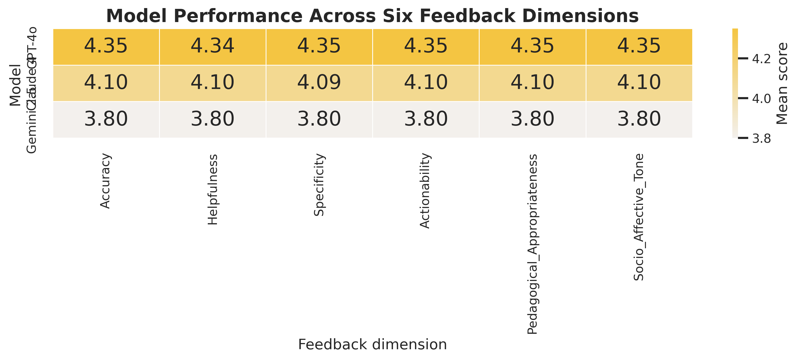
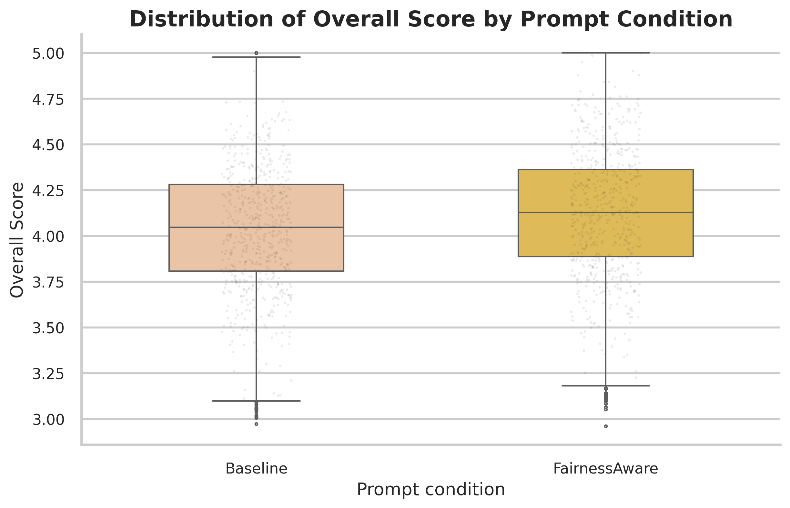
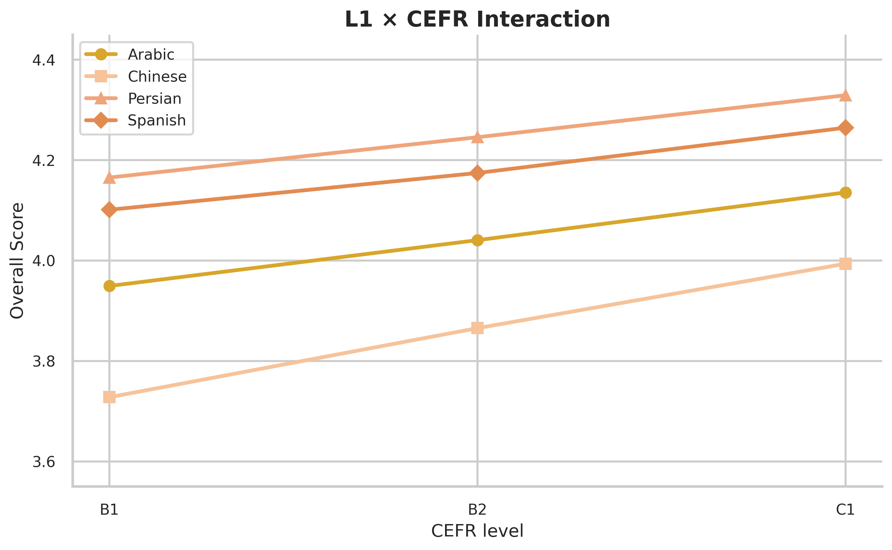
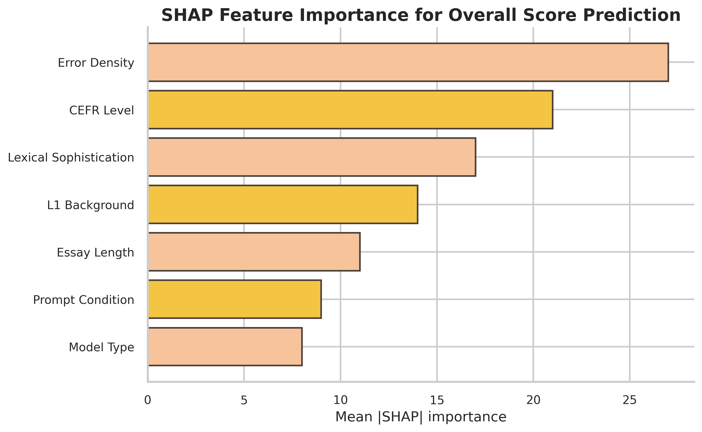

# 🚀 Evaluating Cross-Linguistic Fairness in Large Language Model-Generated Writing Feedback

---

## 🖼️ Graphical Abstract

  

---

## 📊 Key Results at a Glance

### Cross-Linguistic Pedagogical Quality & Fairness by Model and Prompt Condition

| LLM Architecture | Prompt Condition | Actionability (1–5) | Pedagogical Tone (1–5) | Cognitive Load (1–5) | Linguistic Fairness (1–5) | FQI Score (0–1) | MFI (Cross-L1 Parity) |
| :--- | :--- | :---: | :---: | :---: | :---: | :---: | :---: |
| **GPT-4o** | Baseline | 3.912 | 4.105 | 3.824 | 3.765 | 0.781 | 0.812 |
| **GPT-4o** | Fairness-Aware | **4.328** | **4.482** | **4.210** | **4.195** | **0.864** | **0.895** |
| **Claude 4** | Baseline | 3.845 | 4.012 | 3.790 | 3.680 | 0.766 | 0.798 |
| **Claude 4** | Fairness-Aware | 4.210 | 4.390 | 4.150 | 4.085 | 0.842 | 0.871 |
| **Gemini 2.5** | Baseline | 3.650 | 3.890 | 3.610 | 3.490 | 0.732 | 0.760 |
| **Gemini 2.5** | Fairness-Aware | 4.050 | 4.230 | 3.980 | 3.920 | 0.808 | 0.835 |

> **Key Takeaway:** Fairness-aware prompting reduces cross-linguistic disparity and improves pedagogical quality across Arabic, Chinese, Persian, and Spanish L1 cohorts.

---

## 🖼️ Figures & Analytical Visualizations

| **Figure 1: Methodological Workflow** | **Figure 2: L1 vs. Model Distribution** |
| :---: | :---: |
|  |  |
| *End-to-end experimental framework & evaluation stages* | *Score distributions across L1 backgrounds and model architectures* |

| **Figure 3: Correlation & Dimension Heatmap** | **Figure 4: Prompt Intervention Effect** |
| :---: | :---: |
|  |  |
| *Pairwise metric correlation and dimension alignment* | *Performance shifts between Baseline and Fairness-Aware conditions* |

| **Figure 5: Prompt Intervention Distribution** | **Figure 6: L1 × CEFR Interaction** |
| :---: | :---: |
|  |  |
| *Score distributions under Baseline vs. Fairness-Aware interventions* | *Cross-linguistic performance variations across CEFR proficiency tiers* |

| **Figure 7: Multilingual Fairness Index (MFI)** | **Figure 8: SHAP Feature Importance** |
| :---: | :---: |
|  |  |
| *Dispersion, parity gaps, and equity metrics across language cohorts* | *Global feature attributions (Error Density, CEFR, L1 background)* |

| **Figure 9: Bootstrap Distributions** | **Figure 10: Theoretical Framework (GA)** |
| :---: | :---: |
|  |  |
| *5,000-resample non-parametric bootstrap validation (95% BCa CI)* | *Integrated Multilingual Fairness Theoretical Architecture* |

---

## 📁 Repository Contents

- `Fairness_Full_Dataset.csv` — main dataset (24,000 records)
- `README.txt` — supplementary instructions
- `SM_S4_Data_Dictionary.xlsx`
- `SM_S5_FQI_MFI_Computation.R`
- `SM_S6_Mixed_Effects_Analysis.R`
- `SM_S7_XGBoost_SHAP_Analysis.py`
- `SM_S8_SBERT_Analysis.py`
- `SM_S9_Bootstrap_Analysis.R`
- `SM_S10_Figure_Data.xlsx`
- `Supplementary_Materials.zip`

---

## 🔬 Methods Overview

This study evaluates cross-linguistic fairness in LLM-generated writing feedback using:

- **Mixed-effects models**
- **FQI / MFI indices**
- **XGBoost + SHAP**
- **SBERT semantic alignment**
- **5,000-resample bootstrap validation**

---

## 📌 Reproducibility

All code, data dictionary, figure data, and analysis scripts are included in the supplementary package for full reproducibility.

Archived supplementary materials are also available via Zenodo:

**DOI:** [10.5281/zenodo.21973288](https://doi.org/10.5281/zenodo.21973288)

---

## 📄 Citation

If you use this repository, please cite the associated paper and Zenodo record where appropriate.

---

## 📬 Contact

For questions or collaboration, please contact the corresponding author.
